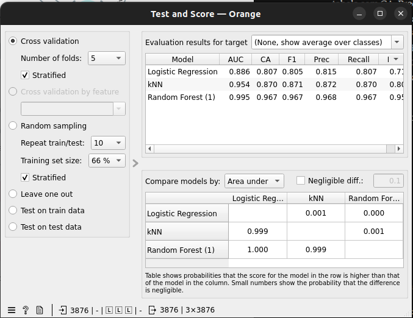
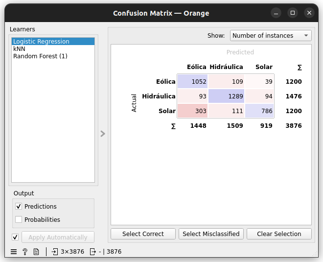
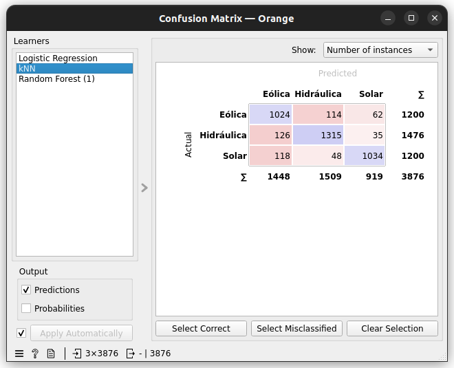
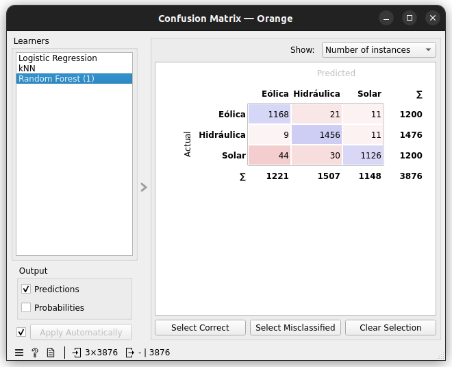
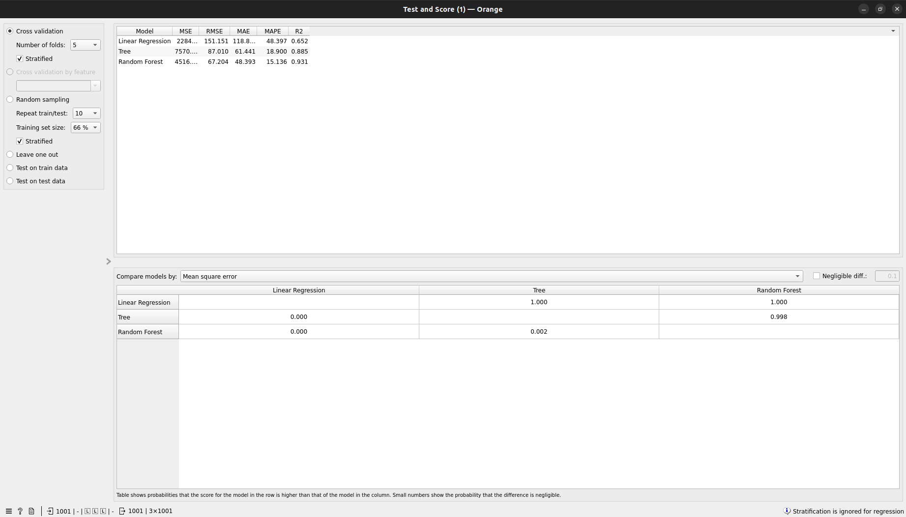
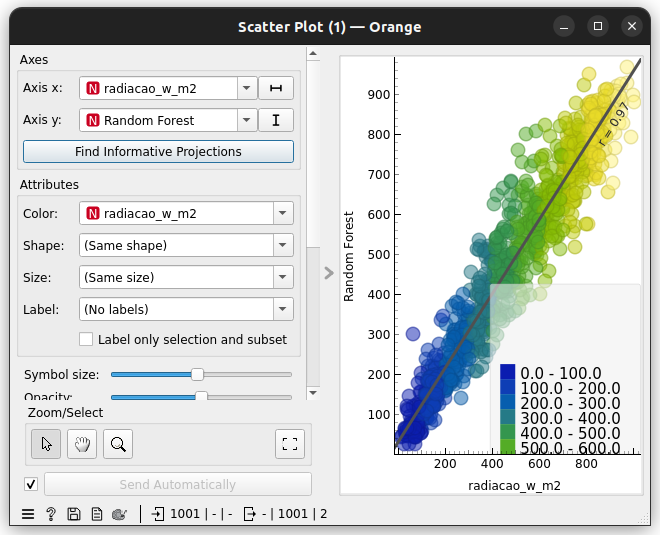

## Parte complementar — Orange Data Mining

Fluxo `.ows` resolvido com dois ramos: classificação (ANEEL) e regressão (Open-Meteo), ambos avaliados por validação cruzada estratificada, 5 folds.

### Classificação — fonte de geração (ANEEL)

| Modelo | CA (Accuracy) | Precision | Recall | F1 | AUC |
|---|---|---|---|---|---|
| Logistic Regression | 0.807 | 0.815 | 0.807 | 0.805 | 0.886 |
| kNN | 0.870 | 0.872 | 0.870 | 0.871 | 0.954 |
| Random Forest | 0.967 | 0.968 | 0.967 | 0.967 | 0.995 |

**Melhor modelo:** Random Forest, com F1 de 0,967 e AUC de 0,995 — bem à frente do kNN (F1 0,871) e da Regressão Logística (F1 0,805).

**Matrizes de confusão:**

**Classes confundidas:** nos três modelos, a maior confusão é entre **Solar e Eólica**. Na Regressão Logística isso é mais grave (303 usinas Solares previstas como Eólica), cai bastante no kNN (118) e fica pequena no Random Forest (44 Solar→Eólica, 30 Solar→Hidráulica). A classe **Hidráulica** é a mais bem separada nos três (1.289, 1.315 e 1.456 acertos em 1.476, respectivamente).

**Limitação:** potência outorgada e localização aproximada não captam a tecnologia de geração em si — no Nordeste do Brasil é comum parques solares e eólicos de porte semelhante estarem instalados em regiões próximas, por isso justamente Solar e Eólica (e não Hidráulica) são as classes mais confundidas.

### Regressão — radiação solar (Open-Meteo)

| Modelo | MSE | RMSE | MAE | MAPE | R² |
|---|---|---|---|---|---|
| Linear Regression | 22.846,6 | 151.151 | 118.8 | 48.4% | 0.652 |
| Tree | 7.570,7 | 87.010 | 61.441 | 18.9% | 0.885 |
| Random Forest | 4.516,4 | 67.204 | 48.393 | 15.1% | 0.931 |

**Melhor modelo:** Random Forest, com o menor erro (MAE 48,4 W/m², RMSE 67,2 W/m²) e o maior R² (0,931). O gráfico Real × Previsto confirma isso visualmente: os pontos ficam bem próximos da diagonal (r = 0,97).

**Procedimento de avaliação escolhido:** usamos validação cruzada (5 folds) em vez da divisão temporal 80/20 sugerida no enunciado. Essa escolha embaralha a ordem cronológica dos registros, então horas vizinhas podem acabar em treino e teste ao mesmo tempo — isso tende a inflar um pouco os resultados em relação a uma previsão real "para o futuro", já que o modelo pode se beneficiar de padrões muito próximos no tempo que já viu no treino. Ainda assim, a ordem relativa entre os três algoritmos (Random Forest > Tree > Regressão Linear) é a mesma observada no notebook com divisão temporal real.

**Por que radiação não é geração elétrica:** o valor em W/m² é só a energia solar que chega por área, por hora. Geração elétrica real dependeria ainda da área e eficiência dos painéis, ângulo de instalação, perda de eficiência por temperatura do módulo e perdas do inversor — nenhuma dessas variáveis está nos dados usados aqui.
